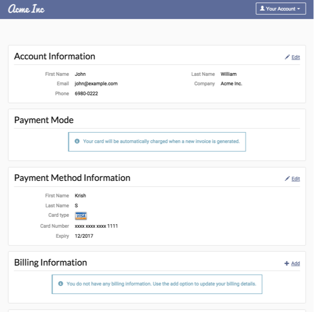

# CUSTOMER PORTAL

* [Introduction](#introduction)
* [What can I do with the open source portal code?](#what-can-i-do-with-the-open-source-portal-code)
* [Why would I want to use this?](#why-would-i-want-to-use-this)
* [What can be done with this code?](#what-can-be-done-with-this-code)
* [How is user management handled?](#how-is-user-management-handled)
* [Theme customization](#theme-customization)
* [Configuration](#configuration)
* [How to get started?](#how-to-get-started)
* [Feature wishlist and how to implement](#feature-wishlist-and-how-to-implement)
* [License](#license)

## Introduction
Chargebee is a subscription billing management service that eases the complexities involved in managing recurring payments. As part of a comprehensive subscription lifecycle management system, Chargebee provides hosted checkout pages and 'customer portals'.

As your business scales up, you might come across a scenario where you’d want certain specific and essential features to be implemented in your customer portal. Needless to say, this comes with a lot of dependencies such as:

* The waiting time for the feature to be fully developed.
* The iterations needed to get the feature right based on your requirements. 
* Additional cost. 

Although Chargebee's default [customer portal](https://www.chargebee.com/docs/customer_portal.html) covers the basic account management functionalities, some of you might need extensive customization based on your business needs. For this reason, we’ve created an open source implementation of the customer portal using our own API- so that you can continue to develop customized features of varying degrees or individual specificity, independently without the wait time.

## What can I do with the open source portal code?

The code base for this portal is built on PHP and mirrors our current portal in terms of the UI and features. You could fork this to add any additional features that you think would help your business such as:

* Reactivate Subscription (already available in the open source )
* Pause Subscription 
* One time Checkout
* Option to display customer specific plans, etc.

## Why would I want to use this?

***To help you transition to your own implementation easily***

This portal implementation adopts the UI and CSS from Chargebee’s portal.

***For easy  adoption and to make changes to the portal using Bootstrap***

The UI for this portal is built using Bootstrap CSS and a base customized CSS is borrowed from Chargebee’s customer portal theme. 

***To add necessary functionalities on your own***

The code is modular which makes it easy to add the functionalities you need using the configuration files present under portal/config directory.

Here’s a quick look at the open source portal design:



Below are the list of functions present in this portal:
* Update Account Information
* Add/Update Billing Address
* Add/Update Payment Method
* Add/Update Shipping Address
* View & Download Past Invoices
* Cancel Subscription
* Reactivate Subscription

## What can be done with this code?

This portal implementation adopts the UI and CSS from Chargebee’s portal to help you transition to your own implementation easily.

The UI for this portal built using Bootstrap CSS and the base customized CSS is borrowed from Chargebee’s customer portal theme. This is because it’s easy to adopt and make changes to the portal using Bootstrap. 

The code is modular which makes it easy to add the functionalities you need using the configuration files present under portal/config directory.

## How is user management handled?

Chargebee’s user management supports the entire account setup starting from portal set up to email address verification, password retrieval, login, and logout. 

To understand the detailed workflow of the signup process, please follow the link below: 
https://www.chargebee.com/docs/customer_portal.html#how-can-your-customers-access-their-portal

The code that integrates with Chargebee’s user management system is located in [Auth.php](portal/Auth.php).

If you already have a user management system at your end, you could ignore this section and directly insert your authentication code in init.php. The rest of the codebase can be used as such.

## Theme customization
If you’re using our user management option, you would have to customize the theme to match your website. 

## Configuration

The configuration details of this implementation are captured in the files present under the [portal/config](portal/config/) directory.

**portal/config/config.ini:** This captures the settings that are required to connect to Chargebee account.

**portal/config/infoandalerts.ini:** This captures the info & alerts texts displayed across the portal. You can customize the content as needed.

**portal/config/portalsettings.ini:** This can be used to control the actions allowed in the portal.  

*Example:*   
1. If you do not want to allow your customers to cancel their subscription via the portal, you could set *cancelsubscription[allow]= ‘false’*.  
2. If you’d like to allow your customers to change the plan but not the quantity, you could set *changesubscription[allow] = 'true'* and *changesubscription[planqty] = 'false'*.

## How to get started?

In order to use this portal, you would have to:

1. Add your server domain in your Chargebee site under *Settings> Hosted Page Settings> Whitelist Return URL> Whitelisted Domain*. Please note that we only support port numbers 443, 80, 8443, 8080 & 9001.

2. Edit the properties below in the "portal/config/config.ini" file:
   * SITE_URL and CANCEL_URL should be your server domain.
   * APP_PATH: The name of the folder created in the ROOT directory. *Eg:* If the portal files are saved in your ROOT directory as portal, then the app path value should be the same (portal).
    * SITE_NAME: Your Chargebee site name.
    * SITE_API_KEY: Chargebee site API key.
    * COOKIE_DOMAIN: should be your server domain.

    ```ini
    [GLOBAL]
    SITE_URL = http://localhost
    CANCEL_URL = http://localhost

    [PATH] ;Set the APP PATH (Relative to ROOT Folder). Eg: If the portal files are saved in your ROOT directory as portal, then the app path value should be the same (portal).
    APP_PATH = portal

    [CHARGEBEE_ENVIRONMENT] ;Configure your Chargebee site name and API key.
    SITE_NAME = <your-chargebee-site-name>
    SITE_API_KEY = <your-chargebee-site-api-key>

    [CHARGEBEE_COOKIE]
    COOKIE_DOMAIN = localhost
    COOKIE_PATH = /portal
    ```

If you need assistance with the implementation, or have requirements regarding the same, please write to support@chargebee.com. 

## Feature wishlist and how to implement 

Below is the implementation guide for features that might be important for your business. 

### Multiple Subscription
The existing code can be easily customized to support multiple subscriptions. 

When Chargebee’s authentication module is used:

As soon as the user is redirected from Chargebee, the “[Activate Portal Session](https://apidocs.chargebee.com/docs/api/portal_sessions#activate_a_portal_session)” API is called. In response, we return the list of subscriptions associated with the customer. If more than 1 subscription is present for the customer, you could direct him/her to a page where the subscription details are displayed. Depending on the subscription selected, the portal can be initialized by passing the subscription id to the [ServicePortal](https://github.com/chargebee/customer-portal-php/blob/master/portal/init.php#L63) object in the init.php file.

When your own authentication module is used:

You could call the “[List Subscriptions For A Customer](https://apidocs.chargebee.com/docs/api/subscriptions#list_subscriptions_for_a_customer)” API to receive subscription details of a particular customer. If more than 1 subscription is present for a customer, you could direct him/her to a page where the subscription details are displayed. Depending on the subscription selected, the portal can be initialized by passing the subscription id to the [ServicePortal](https://github.com/chargebee/customer-portal-php/blob/master/portal/init.php#L63) object in the init.php file.


### One Time Purchase


Say a customer of yours wants to purchase a product that you’d sold in the past. You could create a page that would list all the products available for one time purchase. You would typically have a third party cart that the customer would use to select the product. When a customer places the order, instead of requesting the customer to checkout once again, you could connect with Chargebee via API and process the order through.

The one time products should be set up in Chargebee as Non Recurring Addons. You could list the one time products in a page and display this link/page in the Customer Portal. The products in the page have to be linked to the Non Recurring Addons in Chargebee. The [List Addon](https://apidocs.chargebee.com/docs/api/addons#list_addons) API call can be used to fetch and display the addon details.

When the product is selected by the user, the product ID would be used to call the [Create Invoice](https://apidocs.chargebee.com/docs/api/invoices#create_an_invoice) API. Once the API call is successful, Chargebee will send a response and using this information, you could display the invoice details to the customer. The invoice will also be available in the portal.

### Pause Subscription

If the subscription is paused, the following things have to be considered:

* The customer should not be billed during the paused period. 
* The product should not be shipped during the paused period. 
* There should be an option to filter out subscriptions that have been paused.
* Email Notifications (if enabled) should be customized accordingly.


With these in mind, the best way to achieve it would be by using a Custom Field value “Paused”. The workflow is as below:

1. When the subscription is paused by the customer, “[Update a Customer](https://apidocs.chargebee.com/docs/api/customers#update_a_customer)” API has to be called and the custom field value should be passed (Paused= True).

2. The next billing date should then be changed using the “[Change Term End](https://apidocs.chargebee.com/docs/api/subscriptions#change_term_end)” API call.

3. If the “Subscription Changed” email notification is enabled, the customer will receive an email with the subscription changes. This email can be customized to include specific messages such as “Your subscription has been paused until X”. This can be done using conditions similar to the one shown below:

  ```
  {{#customer.cf_paused}}
	Your subscription has been paused until X
  {{/customer.cf_paused}}
  ```

4. When the paused term gets over, the subscription renewal event will be triggered. Using this, “Update a customer” API has to be called to update the Custom Field value (Paused= false). When the paused term ends, the subsequent renewal dates will also change. The customer could be informed about this either while the subscription is being paused (a text message perhaps) or through the “Subscription Changed” email notification.

**Optional**: The customer could also have the option to “Resume” the subscription. The billing date can also be set by the customer. In this case as well, the subsequent renewal dates will be changed ( a text message showing this before confirmation).

In the future, if you’d like to retrieve information about “Paused” subscriptions, you could do that by using the custom field value as the filter criteria.

If the subscription is paused while it is:

* In Trial:  The subscription status remains “In Trial”.
* Active: The subscription status remains “Active”.
* Future: The subscription status remains the same and the next billing date is pushed further ahead.
* Non Renewing: You might not want to show the “Pause” subscription option here because in this case, only the cancellation date will be shifted.
Cancelled: Hide the option.

**Reports And Exports**

Subscription pause will not affect the Active subscription count and the MRR reports. 

Once the “Pause Subscription” feature is implemented, if you’d like to take an export of Active subscriptions alone, you’d have to use an additional filter criteria to ensure that the subscriptions with the custom field value “Paused” are excluded. 


## License
See the LICENSE file
